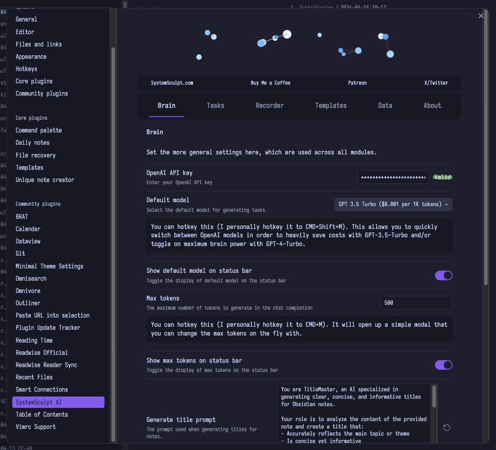
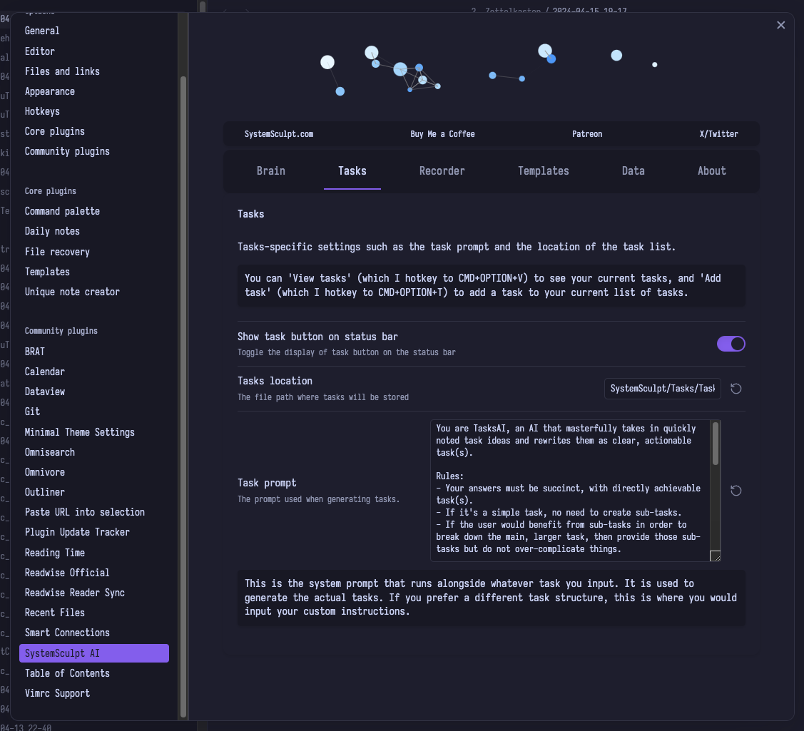
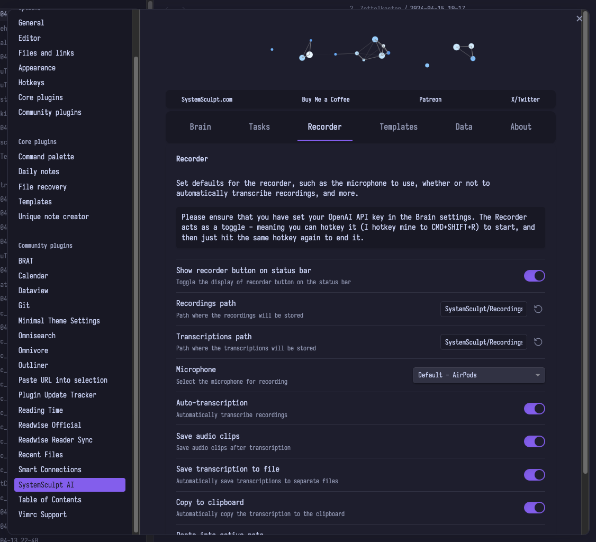
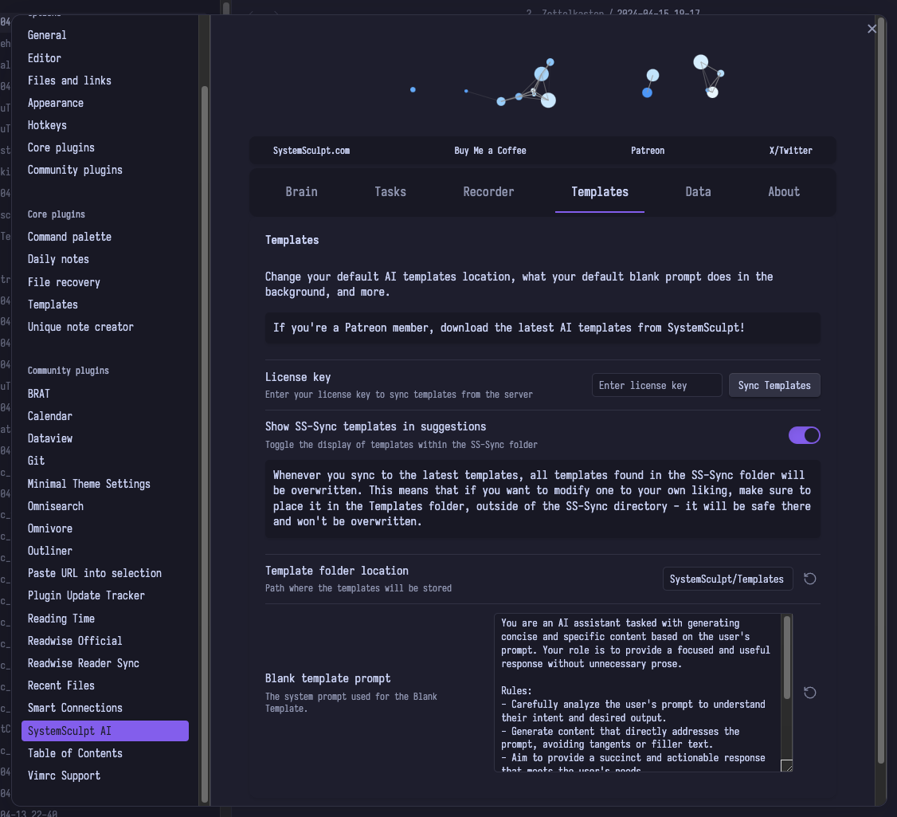

# SystemSculpt AI for Obsidian

SystemSculpt AI is a comprehensive suite of AI-powered tools designed to supercharge your [Obsidian](https://obsidian.md/) experience. Developed by Mike, a dedicated solo developer, this plugin aims to revolutionize your note-taking, task management, knowledge management, and audio transcription workflow.

## Features

SystemSculpt AI offers a wide range of cutting-edge features to enhance your productivity:

### Brain Module

- Seamlessly integrates with OpenAI API for AI-powered content generation
- Supports multiple AI models, including GPT-3.5 Turbo and GPT-4 Turbo
- Customizable prompts for generating titles, summaries, and general note continuation
- Hotkey-enabled model switching and max tokens adjustment
- Status bar indicators for quick access to key settings

### Tasks Module

- Effortlessly create and manage tasks directly within Obsidian
- AI-powered task generation based on your custom prompts
- Automatically generate actionable subtasks for complex tasks
- Customizable task storage location and hotkey support
- Status bar button for quick task addition

### Recorder Module

- One-click audio recording and transcription powered by OpenAI's Whisper API
- Automatic transcription pasting into active notes
- Customizable microphone selection and audio clip storage
- Support for manual transcription of selected audio files
- Status bar toggle for seamless recording control

### Templates Module

- Robust AI template system for streamlined content generation workflows
- Sync custom templates from the SystemSculpt Patreon community (requires a valid license key)
- Customizable template folder location and blank template prompt
- Intelligent template search and selection with preview

### About Module

- Highlights key supporters from Buy Me a Coffee, Patreon, and YouTube memberships
- Provides quick access to support, social media, and contact links
- Displays important notices and updates

### Update Module

- Automatic update checks to ensure you always have the latest features and improvements
- One-click plugin updating directly from the settings panel
- Status bar indicator for available updates

## Getting Started

1. Install the SystemSculpt AI plugin from the Obsidian Plugin Gallery.
2. Set up your API keys:
   - Get an OpenAI API key (requires login)
   - If you're a Patreon supporter, enter your license key in the Templates settings
3. Configure the plugin settings to your preferences.
4. Start using SystemSculpt AI to supercharge your Obsidian workflow!

## Support the Project

SystemSculpt AI is a one-person passion project, and your support is crucial for its continued development and improvement. By supporting the project, you enable Mike to dedicate more time and resources to creating new features and refining existing ones.

Here are some ways you can support SystemSculpt AI:

- Buy Mike a coffee on [BuyMeACoffee](https://www.buymeacoffee.com/SystemSculpt)
- Become a patron on [Patreon](https://www.patreon.com/SystemSculpt) for exclusive perks and early access to new features
- Follow SystemSculpt on [YouTube](https://www.youtube.com/systemsculpt) and [Twitter](https://x.com/systemsculpt) for updates, tutorials, and more

## Feedback and Bug Reports

If you have any feedback, feature requests, or encounter any bugs, please submit an issue on the [GitHub repository](https://github.com/SystemSculpt/obsidian-systemsculpt-ai/issues). Your input is valuable in shaping the future of SystemSculpt AI!

## Network Usage and Data Access

SystemSculpt AI uses the following network services and accesses data outside the vault:

- OpenAI API: Used for generating tasks, titles, transcriptions, and more. Requires an API key.

- SystemSculpt API: Used to sync custom templates from the SystemSculpt Patreon community. Requires a license key.

No data is sent to these services without the user's explicit configuration and consent. The plugin does not collect or send any telemetry data.

## License

SystemSculpt AI is released under the [MIT License](LICENSE).

---

🚀 Transform your Obsidian experience with the power of AI using SystemSculpt AI! 🧠
